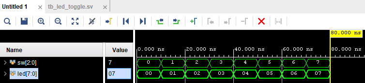
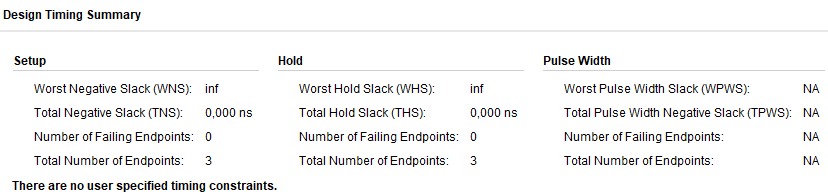
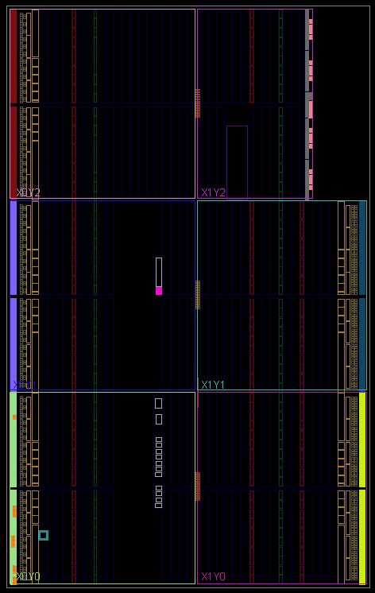
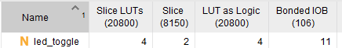

# Project Directory Structure

```
led_toggle/
├──rtl
│   ├── led_toggle.sv       # LED toggle
│
├──tb
│   ├── tb_led_toggle.sv    # Testbench
│
├──build
│   ├── led_toggle.xdc      # Constraints
```

# LED Toggle FPGA Lab

This repository contains the Verilog/SystemVerilog code and related files for an FPGA lab that demonstrates a simple LED toggle design. Below is an explanation of the components and their functionality.

---

## Project Description

The `led_toggle` module is a simple design where switches (`sw`) control the state of LEDs (`led`). Depending on the binary value of the switches, a corresponding LED will light up.

---

## Files and Description

### `led_toggle.sv`

```verilog
module led_toggle (
    input  logic [2:0] sw,
    output logic [7:0] led
);

  always_comb begin
    case (sw)
      3'b000: led = 8'b0000_0000;
      3'b001: led = 8'b0000_0001;
      3'b010: led = 8'b0000_0010;
      3'b011: led = 8'b0000_0100;
      3'b100: led = 8'b0000_1000;
      3'b101: led = 8'b0001_0000;
      3'b110: led = 8'b0010_0000;
      3'b111: led = 8'b0100_0000;
    endcase
  end

endmodule
```

This module:
- Accepts a 3-bit switch input (`sw`).
- Outputs an 8-bit LED signal (`led`), lighting one LED based on the switch's binary value.

### `tb_led_toggle.sv`

```verilog
`timescale 1ns / 1ps  // `timescale <time unit>/<time precision>

module tb_led_toggle ();

  logic [2:0] sw;
  logic [7:0] led;

  led_toggle u_led_toggle (
      .sw (sw),
      .led(led)
  );

  initial begin
    $printtimescale(tb_led_toggle);
    sw = '0;
    for (int i = 0; i < 8; i++) begin
      $display("Switch state is : %-5d", i[2:0]);
      sw = i[2:0];
      #10;
    end

    $stop;
  end
endmodule
```

This testbench:
- Simulates the `led_toggle` module.
- Iterates through all possible switch values and observes the LED output.

---

## Constraints File

### Switches

```tcl
set_property -dict { PACKAGE_PIN V17   IOSTANDARD LVCMOS33 } [get_ports {sw[0]}]
set_property -dict { PACKAGE_PIN V16   IOSTANDARD LVCMOS33 } [get_ports {sw[1]}]
set_property -dict { PACKAGE_PIN W16   IOSTANDARD LVCMOS33 } [get_ports {sw[2]}]
```

### LEDs

```tcl
set_property -dict { PACKAGE_PIN U16   IOSTANDARD LVCMOS33 } [get_ports {led[0]}]
set_property -dict { PACKAGE_PIN E19   IOSTANDARD LVCMOS33 } [get_ports {led[1]}]
set_property -dict { PACKAGE_PIN U19   IOSTANDARD LVCMOS33 } [get_ports {led[2]}]
set_property -dict { PACKAGE_PIN V19   IOSTANDARD LVCMOS33 } [get_ports {led[3]}]
set_property -dict { PACKAGE_PIN W18   IOSTANDARD LVCMOS33 } [get_ports {led[4]}]
set_property -dict { PACKAGE_PIN U15   IOSTANDARD LVCMOS33 } [get_ports {led[5]}]
set_property -dict { PACKAGE_PIN U14   IOSTANDARD LVCMOS33 } [get_ports {led[6]}]
set_property -dict { PACKAGE_PIN V14   IOSTANDARD LVCMOS33 } [get_ports {led[7]}]
```

### Configuration Options

These configuration options are applicable to all designs:

```tcl
set_property CONFIG_VOLTAGE 3.3 [current_design]
set_property CFGBVS VCCO [current_design]
```

### SPI Configuration Mode

For QSPI boot:

```tcl
set_property BITSTREAM.GENERAL.COMPRESS TRUE [current_design]
set_property BITSTREAM.CONFIG.CONFIGRATE 33 [current_design]
set_property CONFIG_MODE SPIx4 [current_design]
```

---

## Simulation

1. Use the provided testbench (`tb_led_toggle.sv`) to verify the functionality of the design.
2. The testbench iterates through all switch states (`sw`) and displays the corresponding LED output in the simulation log.

---

## Synthesis and Implementation

1. Load the constraints file into your FPGA project to map switches and LEDs to the correct pins.
2. Synthesize and implement the design using your FPGA toolchain.
3. Program the FPGA and test the functionality using the hardware.

---

## Hardware

- **FPGA Board**: Basys3 or equivalent.
- **Inputs**: 3 slide switches.
- **Outputs**: 8 LEDs.

---

# Waveform



The steps to generate a bitstream are as follows:
1. Synthesis: Map SystemVerilog to an intermediate logic format for optimizing.
2. Implementation: Place the design, optimize the place results, and route the design.
3. Generate bitstream: Generate the physical file to download to the board.

# Implemented Design
There is no timing since this design is purely combinational, otherwise we'd see more information regarding timing numbers.





# Utilization Report


3 switchs + 8 leds = 11 IO

# Note
Do you occasionally see one flicker as the switches are flipped?
- Yes

# Youtube
[Watch the video on YouTube](https://img.youtube.com/vi/abc123/0.jpg)
