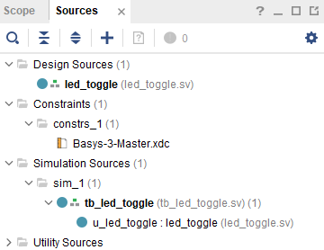
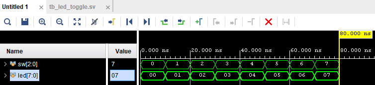
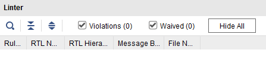
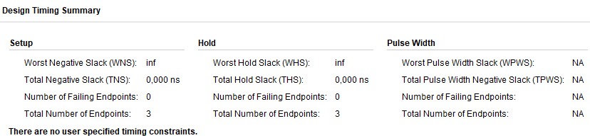
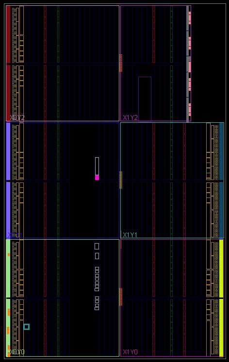
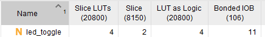

# Design Sources

# Simulation

The steps to generate a bitstream are as follows:
1. Synthesis: Map SystemVerilog to an intermediate logic format for optimizing.
2. Implementation: Place the design, optimize the place results, and route the design.
3. Generate bitstream: Generate the physical file to download to the board.

# Vivado Linter

# Implemented Design
There is no timing since this design is purely combinational, otherwise we'd see more information regarding timing numbers.

# Utilization Report

3 switchs + 8 leds = 11 IO

# Note
Do you occasionally see one flicker as the switches are flipped?
- Yes