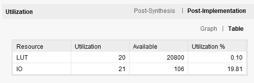

# Lab 2: Advanced FPGA Designs

This repository contains the Verilog/SystemVerilog code and related files for Lab 2 of our FPGA series. This lab focuses on more advanced concepts, including arithmetic operations and leading/trailing bit detection.

---

## Project Description

Lab 2 introduces several modules to perform arithmetic operations, detect leading/trailing bits, and count active bits in a signal. These modules demonstrate parameterization, case-based logic, and iterative design patterns.

---

## Files and Directory Structure

```
Lab2/
├── build/                # Build directory for output files
├── rtl/                  # Source files
│   ├── add_sub.sv        # Adder/Subtractor module
│   ├── leading_ones.sv   # Leading ones detection module
│   ├── mult.sv           # Multiplier module
│   ├── num_ones.sv       # Active bit counter module
│   └── project_2.sv      # Integrated project module
├── tb/                   # Testbenches
│   └── tb_project_2.sv   # Testbench for the integrated project
├── doc/image-1.png           # Design flow diagram
├── doc/image-2.png           # Module hierarchy diagram
├── readme.md             # Documentation file
```

---

## Modules Description

### `add_sub.sv`

This module performs addition or subtraction based on a selector parameter.

### `leading_ones.sv`

Detects the position of the first active bit from the MSB side. Includes multiple implementation styles like `UNIQUE_CASE` and iterative loops.

### `mult.sv`

Performs signed multiplication on two inputs split from a combined switch signal.

### `num_ones.sv`

Counts the number of active bits (`1`s) in the input vector using an iterative approach.

### `project_2.sv`

Integrates all modules into a single project that operates based on button presses. Each button corresponds to a specific functionality.

---

## Testbench

The testbench `tb_project_2.sv` validates the integrated project module. It includes random stimulus generation and corner-case testing for all submodules.

---

## Constraints File

### Switches

```tcl
set_property -dict { PACKAGE_PIN V17   IOSTANDARD LVCMOS33 } [get_ports {sw[0]}]
set_property -dict { PACKAGE_PIN V16   IOSTANDARD LVCMOS33 } [get_ports {sw[1]}]
set_property -dict { PACKAGE_PIN W16   IOSTANDARD LVCMOS33 } [get_ports {sw[2]}]
...
```

### LEDs

```tcl
set_property -dict { PACKAGE_PIN U16   IOSTANDARD LVCMOS33 } [get_ports {led[0]}]
set_property -dict { PACKAGE_PIN E19   IOSTANDARD LVCMOS33 } [get_ports {led[1]}]
...
```

### Buttons

```tcl
set_property -dict { PACKAGE_PIN U18   IOSTANDARD LVCMOS33 } [get_ports BTNC]
set_property -dict { PACKAGE_PIN T18   IOSTANDARD LVCMOS33 } [get_ports BTNU]
...
```

---

## Hardware Requirements

- **FPGA Board**: Basys3 or equivalent
- **Inputs**: 16 slide switches, 5 push buttons
- **Outputs**: 16 LEDs

---

# Leading Ones

## Unique


## Without Unique


## Down For


## Up For


# PULP Platform lzc Module


# Number of Ones



# Adder-Subtractor

## Adder


## Subtractor


# Multiplier


# Project-2
