# Leading Ones

## Unique

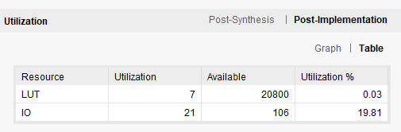

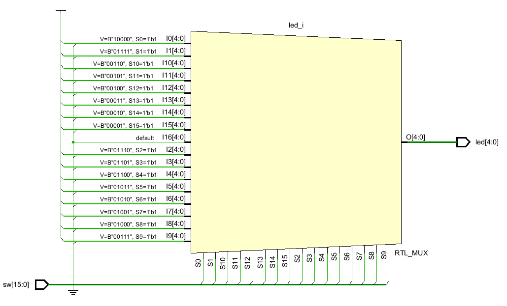

Unique ifadesini kullandığımızda fpga'deki kaynak kullanımımız azaldı. Aynı şekilde ASIC'te de bu optimizasyonu bekleriz.

Fakat inputların one-hot geleceğinin garanti olduğu sistemlerde bu tasarım iyidir. Aksi taktirde birden fazla bitin aynı anda high olması
Tasarımın hatalı çalışmasına neden olacaktır.

## Without Unique

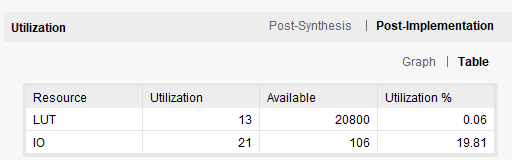

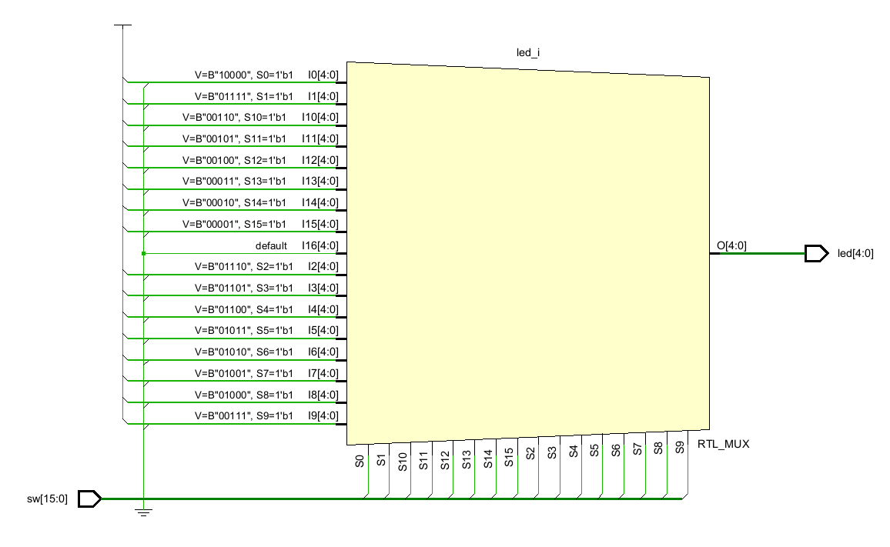

Unique olmadan bütün devre optimize edilmeden sentezlenir. Sentezlenen devre one-hot input beklemez aksine en yüksek bitin priority'si yüksek olduğundan leading one doğru şekilde bulunur.

## Down For

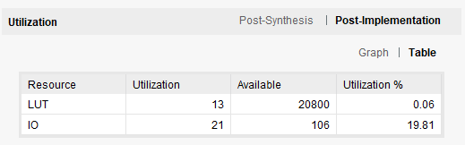

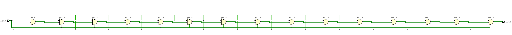

Break burada loop roll-up olabilecekse kullanmak mantıklıdır. Aslında en mantıklı çözüm break yerine kullanılacak bir yöntem varsa onu seçmektir. Çünkü sentez toolu for loop'u açarak priority yapısını sentezler. Eğer devre karışıksa sentez tool'u break ifadesini doğru sentezleyemeyebilir.

## Up For

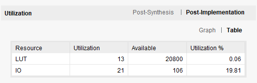

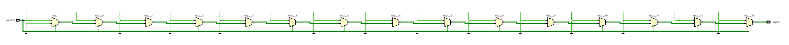

Bu yapı break kullanmadan aynı loop devresini yazmanın bir yoludur. always_comb trigger'landığında hep led değeri en son sw'in gösterdiği değere göre güncellenir. always_comb'um procedural çalışma mekanizması sayesinde bu devre rahatlıkla çalışır.

Genele baktığımızda amaç leading one'dan binary yapıya geçmek, ilk durum ise one hot leading yapıdan binary karşılığına geçiyor.

# PULP Platform lzc Module

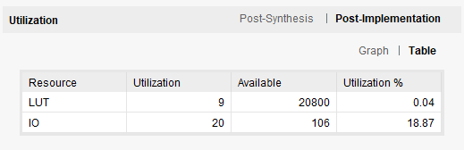

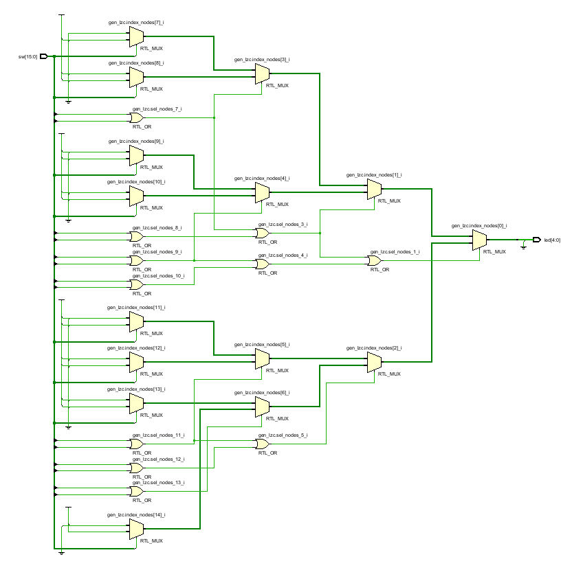

# Number of Ones

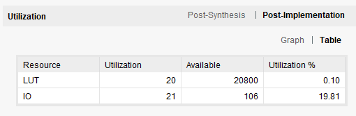

# Adder-Subtractor

## Adder
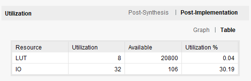

## Subtractor
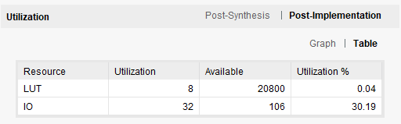

# Multiplier
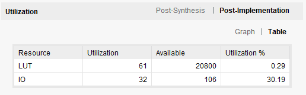

# Project-2
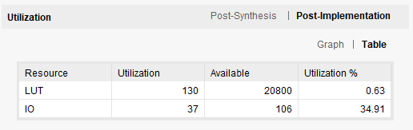